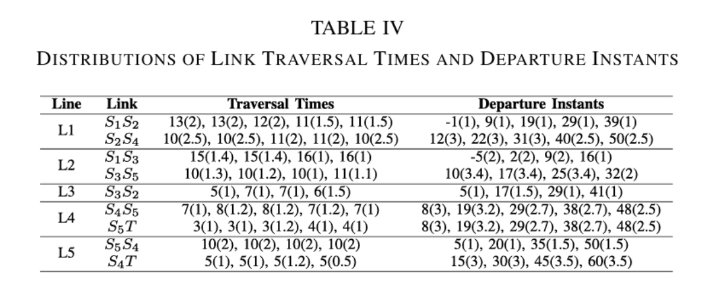

# 第一周(1.4-1.11):

## 周计划：

### 1.4：

- [x] 阅读论文An Effective UAV Scheduling Algorithm for Public Transportation-assisted Urban Surveillance System
- [x] 阅读论文Optimizing Energy Efficiency in Last-Mile Delivery A Collaborative Approach with Public Transportation System and Drones
- [x] 制作组会ppt

### 1.5:

- [x] 找了三篇速度可变的卡车+无人机物流配送的论文
- [x] 文章1：The multiple flying sidekicks traveling salesman problem with variable drone speeds 2020
- [x] 文章2：Integrated speed optimization and multivisit drone routing: a mathematical programming approach 2025
- [x] 文章3：Minimizing energy and cost in range-limited drone deliveries with  speed optimization 2019
- [x] 阅读论文The multiple flying sidekicks traveling salesman problem with variable drone speeds

### 1.6:

- [x] 阅读论文The multiple flying sidekicks traveling salesman problem with variable drone speeds

### 1.7:

- [x] 阅读论文The multiple flying sidekicks traveling salesman problem with variable drone speeds

### 1.8:

- [x] 阅读论文The multiple flying sidekicks traveling salesman problem with variable drone speeds
- [x] 写文章摘要

# 第二周(1.12-1.18):

#### 问题：

与卡车+无人机物流配送中，无人机速度可变的思路有什么不同？

#### 创新点：

目前无人机在配送过程中多以恒定速度飞行，若无人机只能在公交车站点起飞降落，无人机有时需要等待公交车。那么无人机在开始起飞配送前，若可以决定此次飞行任务的速度，就可以避免这种情况。

有论文指出，货运无人机的速度在一定范围内，速度越大，能耗越大。因此，若必要，选择一个较小的飞行速度，减小能耗，同时还能增加飞行距离。

将无人机飞行速度作为决策变量

#### 描述：

有n架无人机需要为m个顾客配送货物，每个顾客仅有一个货物需配送，无人机在仓库装载本趟所需配送的全部货物，从仓库乘坐公交车至距顾客最近的站点起飞，飞向第一个顾客点，为顾客送货，起飞，返回公交车，配送下一个顾客，本趟任务完成后，需乘坐公交车返回仓库。无人机乘坐一趟公交车可以配送多个客户，无人机一次起飞仅配送一名客户。需要考虑一下几个因素：将客户分配给不同的无人机，对顾客交付顺序进行排序；优化无人机速度，在最短的时间内以最小的能耗可行地为顾客送货。

#### 环境：

交通网络使用有向连通图实现，每个公交车停靠站点之间应该存在至少一条线路，应考虑公交车时刻表的不可预测性

#### 公交车:

公交车沿预设公交车线路运行，每辆公交车的发车时间、站点至站点间的行驶时间有所差异，公交车行驶到停靠站点时应停靠3分钟,每条公交车线路每隔t分钟发一辆车，发车时间也有所差异。公交车线路是双向的，可去可回。

#### 目标：

最小化无人机总能耗。

#### 能耗模型：

总能耗=无人机从公交车起飞+(飞向客户点+降落+送货+起飞)*n+返回公交车

能耗受无人机飞行速度与载重影响

不同速度有不同的能耗，在一定范围内，速度越大，能耗越大；速度越小，能耗越小。

不同载重有不同的能耗，载重越大，能耗越大；载重越小，能耗越小；

无人机在不同阶段飞行过程有不同能耗，如起飞、巡航、悬停、下降

#### 飞行阶段：需要决定飞行速度阶段，无人机在起飞和降落阶段速度固定

1.从公交车起飞，飞向顾客点送货的速度

2.从客户点飞向公交车顶的速度

#### 解决方法：

需要考虑一下几个因素：将客户分配给不同的无人机，对顾客交付顺序进行排序；优化无人机速度，在最短的时间内以最小的能耗可行地为顾客送货。

#### 限制：

无人机只能在公交车站点起飞降落

#### 实验：

可配送范围的提升，配送完总能耗的减少

# 第三周(1.19-1.25):

- [x] 公交车时刻表仅受拥堵程度影响，每条道路边的拥挤程度在0-1之间，0表示越有可能准时到达，1表示越有可能晚点到达，最大晚15%的时间
- [x] 完成了能耗模型的构建，energy_total=p_TakeOff*t_TakeOff+(p_b_to_c * t_flight+p_landing * t_landing + p_newTakeOff*t_TakeOff) * n + p_NewFlight * t。无人机主要受到空气阻力以及无人机飞行速度与载荷的影响

